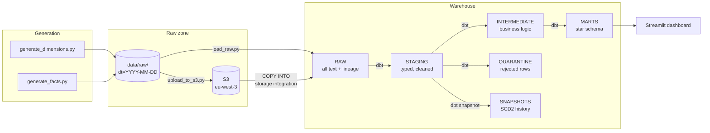

# Architecture

## The flow



Airflow runs the whole sequence on a schedule. Terraform provisions S3 and the Snowflake
objects. GitHub Actions rebuilds everything from scratch on every push. Elementary records
what each run did.

## The two warehouses

The same dbt models build on either engine. DuckDB is the local development target and
needs no credentials; Snowflake is the cloud target. Switching is a profile change:

```bash
dbt build --profiles-dir .                     # DuckDB
dbt build --profiles-dir . --target snowflake  # Snowflake
```

Both produce identical results — verified by comparing row counts, revenue, late orders,
open orders, stockout counts and the date dimension across the two, which match exactly.

Where the SQL dialects genuinely differ, the difference is isolated rather than forked.
`dbt.datediff` and `dbt.current_timestamp` come from dbt's cross-database macros; ISO week
and ISO weekday are dispatched per adapter in `macros/cross_db.sql`. `dim_date` is built
from the distinct dates already in the inventory fact rather than a generated series,
which sidesteps the incompatible `generate_series` implementations entirely.

## Why the layers exist

**RAW** is a faithful, untyped copy of what arrived, with `_source_file` and `_loaded_at`
for lineage. Keeping it dumb means a transformation bug is always recoverable by rebuilding
from source rather than re-ingesting.

**STAGING** does the casting and cleaning, one view per source. `clean_cast` handles blanks
and whitespace uniformly, and uses `try_cast` so a single unparseable value nulls out
instead of aborting the model.

**INTERMEDIATE** holds the business logic that is too involved for staging and shouldn't be
buried inside a mart: purchase-order delays, the trailing demand rate, and stock status
with days of cover.

**MARTS** is the star schema — four dimensions and three facts, joined on natural keys
([ADR 0002](adr/0002-natural-keys-in-dimensions.md)).

**QUARANTINE** catches rows that fail validation so the pipeline degrades instead of
stopping.

**SNAPSHOTS** holds Type-2 supplier history.

## Security

Nothing in the repo contains a credential. `.env` is gitignored and holds everything;
Terraform and dbt read it through environment variables via `scripts/tf.ps1` and
`scripts/dbt.ps1`.

Snowflake reads S3 through a storage integration that assumes an IAM role, so **Snowflake
never holds an AWS key**. The role's trust policy requires a specific external id, which
prevents another Snowflake account from borrowing the integration. The IAM policy grants
read-only access to one bucket.

Three Snowflake roles split access by what each job needs: `NOVASUPPLY_LOADER` writes to
RAW, `NOVASUPPLY_TRANSFORMER` builds every layer and is what dbt runs as,
`NOVASUPPLY_ANALYST` can only select from MARTS. Day-to-day work never runs as
`ACCOUNTADMIN`.

Sensitive supplier terms are protected by a secure view resolving against `current_role()`
([ADR 0006](adr/0006-secure-view-instead-of-masking-policy.md)).

The S3 bucket blocks all public access, encrypts at rest, versions every object, and
expires non-current versions after 30 days.
