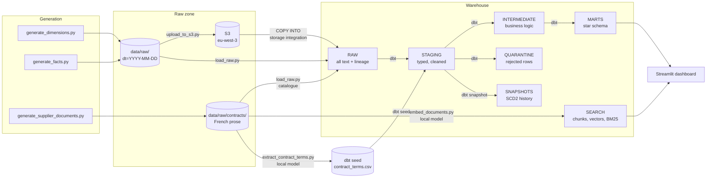

# Architecture

## The flow


```mermaid
flowchart LR
    subgraph gen["Generation"]
        G1[generate_dimensions.py]
        G2[generate_facts.py]
        G3[generate_supplier_documents.py]
    end

    subgraph raw["Raw zone"]
        L[("data/raw/<br/>dt=YYYY-MM-DD")]
        C[("data/raw/contracts/<br/>French prose")]
        S3[("S3<br/>eu-west-3")]
    end

    subgraph wh["Warehouse"]
        direction TB
        R["RAW<br/>all text + lineage"]
        ST["STAGING<br/>typed, cleaned"]
        IN["INTERMEDIATE<br/>business logic"]
        M["MARTS<br/>star schema"]
        Q["QUARANTINE<br/>rejected rows"]
        SN["SNAPSHOTS<br/>SCD2 history"]
        SE["SEARCH<br/>chunks, vectors, BM25"]
    end

    SD[("dbt seed<br/>contract_terms.csv")]
    D[Streamlit dashboard]

    G1 --> L
    G2 --> L
    G3 --> C
    L -->|upload_to_s3.py| S3
    L -->|load_raw.py| R
    C -->|load_raw.py<br/>catalogue| R
    S3 -->|COPY INTO<br/>storage integration| R
    C -->|embed_documents.py<br/>local model| SE
    C -->|extract_contract_terms.py<br/>local model| SD
    SD -->|dbt seed| ST
    R -->|dbt| ST
    ST -->|dbt| IN
    ST -->|dbt| Q
    ST -->|dbt snapshot| SN
    IN -->|dbt| M
    M --> D
    SE --> D
```

Airflow runs the whole sequence on a schedule. Terraform provisions S3 and the Snowflake
objects. GitHub Actions rebuilds everything from scratch on every push. Elementary records
what each run did.

## The two warehouses

The same dbt models build on either engine. DuckDB is the local development target and
needs no credentials; Snowflake is the cloud target. Switching is a profile change:

```bash
dbt build --profiles-dir .                     # DuckDB
dbt build --profiles-dir . --target snowflake  # Snowflake
```

Both produce identical results, verified by comparing row counts, revenue, late orders,
open orders, stockout counts and the date dimension across the two, which match exactly.

Where the SQL dialects genuinely differ, the difference is isolated rather than forked.
`dbt.datediff` and `dbt.current_timestamp` come from dbt's cross-database macros; ISO week
and ISO weekday are dispatched per adapter in `macros/cross_db.sql`. `dim_date` is built
from the distinct dates already in the inventory fact rather than a generated series,
which sidesteps the incompatible `generate_series` implementations entirely.

## Why the layers exist

**RAW** is a faithful, untyped copy of what arrived, with `_source_file` and `_loaded_at`
for lineage. Keeping it dumb means a transformation bug is always recoverable by rebuilding
from source rather than re-ingesting.

**STAGING** does the casting and cleaning, one view per source. `clean_cast` handles blanks
and whitespace uniformly, and uses `try_cast` so a single unparseable value nulls out
instead of aborting the model.

**INTERMEDIATE** holds the business logic that is too involved for staging and shouldn't be
buried inside a mart: purchase-order delays, the trailing demand rate, and stock status
with days of cover.

**MARTS** is the star schema, five dimensions and four facts, joined on natural keys
([ADR 0002](adr/0002-natural-keys-in-dimensions.md)).

**QUARANTINE** catches rows that fail validation so the pipeline degrades instead of
stopping.

**SNAPSHOTS** holds Type-2 supplier history.

**SEARCH** holds the contract corpus chunked, embedded and indexed for BM25. It sits
outside the star schema on purpose: nothing in the marts references it, and the dashboard
queries it directly. Keeping the retrieval index inside the warehouse is what avoids
running a vector database next to it
([ADR 0008](adr/0008-retrieval-over-the-contract-corpus.md)).

## The unstructured path

Contracts enter the platform as prose rather than rows, and take a different route through
it.

`generate_supplier_documents.py` writes them; `load_raw.py` lands only their *catalogue*
(what each document is, and which contract an amendment replaces) into RAW, because that
part is structured and downstream models need it. The prose itself goes two ways:

- `embed_documents.py` chunks it on article boundaries, embeds each clause, and writes the
  vectors and a BM25 index into SEARCH for the dashboard to query;
- `extract_contract_terms.py` reads the commercial terms out of each document into a dbt
  seed, which STAGING then treats as an ordinary source.

Both need a local model, so neither runs in CI or in the DAG, and the extraction output is
committed rather than regenerated ([ADR 0009](adr/0009-llm-steps-outside-ci.md)).

`int_contracts__terms_history` then turns those terms into validity periods, which is what
lets `fct_contract_compliance` judge each order against the contract in force on the day it
was placed rather than against whatever is current now.

## Security

Nothing in the repo contains a credential. `.env` is gitignored and holds everything;
Terraform and dbt read it through environment variables via `scripts/tf.ps1` and
`scripts/dbt.ps1`.

Snowflake reads S3 through a storage integration that assumes an IAM role, so **Snowflake
never holds an AWS key**. The role's trust policy requires a specific external id, which
prevents another Snowflake account from borrowing the integration. The IAM policy grants
read-only access to one bucket.

Three Snowflake roles split access by what each job needs: `NOVASUPPLY_LOADER` writes to
RAW, `NOVASUPPLY_TRANSFORMER` builds every layer and is what dbt runs as,
`NOVASUPPLY_ANALYST` can only select from MARTS. Day-to-day work never runs as
`ACCOUNTADMIN`.

Sensitive supplier terms are protected by a secure view resolving against `current_role()`
([ADR 0006](adr/0006-secure-view-instead-of-masking-policy.md)).

The S3 bucket blocks all public access, encrypts at rest, versions every object, and
expires non-current versions after 30 days.
